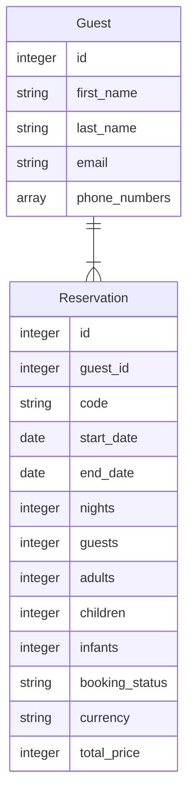

# Inbound API Payload Matching

When publishing an API for third parties to consume, domain objects like users, invoices, etc. can be given a canonical representation, typically in JSON format, that the third party can then transform into their own data structure.

When _consuming_ data from third party sources, transformation from a single data source is fairly straightforward, and does not present much complexity, but consuming data from _multiple_ sources however can present some challenges.

If each integration has its own API endpoint, the data source is implicit, and transformation can be applied accordingly.

But as an interesting challenge, how can we expose a single, generic API endpoint into which multiple sources can feed data in their own data format, and then transform that back into our own internal data structure?

## Reservation system

Let's say we have reservations coming in from two different platforms, which we'll call A and B.

The data structure for platform A looks like:

```json
{
  "reservation_code": "YYY12345678",
  "start_date": "2021-04-14",
  "end_date": "2021-04-18",
  "nights": 4,
  "guests": 4,
  "adults": 2,
  "children": 2,
  "infants": 0,
  "status": "accepted",
  "guest": {
    "first_name": "Wayne",
    "last_name": "Woodbridge",
    "phone": "639123456789",
    "email": "wayne_woodbridge@bnb.com"
  },
  "currency": "AUD",
  "payout_price": "4200.00",
  "security_price": "500",
  "total_price": "4700.00"
}
```

The data structure for platform B looks like:

```json
{
  "reservation": {
    "code": "XXX12345678",
    "start_date": "2021-03-12",
    "end_date": "2021-03-16",
    "expected_payout_amount": "3800.00",
    "guest_details": {
      "localized_description": "12 guests",
      "number_of_adults": 3,
      "number_of_children": 4,
      "number_of_infants": 5
    },
    "guest_email": "wayne_woodbridge@bnb.com",
    "guest_first_name": "Wayne",
    "guest_last_name": "Woodbridge",
    "guest_phone_numbers": [
      "639123456789",
      "639123456789"
    ],
    "listing_security_price_accurate": "500.00",
    "host_currency": "NZD",
    "nights": 5,
    "number_of_guests": 12,
    "status_type": "initialized",
    "total_paid_amount_accurate": "4300.00"
  }
}
```

Some common data points:


- code
- start date
- end date
- nights
- no. of guests
- status
- guest:
  - first name
  - last name
  - phone
  - email

A transformation table might look like:

| Field            | Platform A                | Platform B                         |
| ---------------- | --------------------- | ----------------------------------- |
| Code             | `reservation_code`    | `reservation["code"]`               |
| Start date       | `start_date`          | `reservation["start_date"]`         |
| End date         | `end_date`            | `reservation["end_date"]`           |
| Nights           | `nights`              | `reservation["nights"]`                            |
| Guests           | `guests`              | `reservation["number_of_guests"]`                  |
| Adults           | `adults`              | `reservation["number_of_adults"]`   |
| Children         | `children`            | `reservation["number_of_children"]` |
| Infants          | `infants`             | `reservation["number_of_infants"]`  |
| Booking Status   | `status`              | `reservation["status_type"]`                       |
| Currency         | `currency`            | `reservation["host_currency"]`                     |
| Deposit          | `security_price`      | `reservation["listing_security_price_accurate"]`   |
| Total Price      | `total_price`         | `reservation["total_paid_amount_accurate"]`        |
| Guest first name | `guest["first_name"]` | `reservation["guest_first_name"]`                  |
| Guest last name  | `guest["last_name"]`  | `reservation["guest_last_name"]`                   |
| Guest phone      | `guest["phone"]`      | `reservation["guest_phone_numbers"]`        |
| Guest email      | `guest["email"]`      | `reservation["guest_email"]`                       |

Our internal modelling might look like:



Assuming that more data sources will be added in the future, how might the code be structured?

### Horizontal vs. vertical code structures

I've seem similar challenges addressed using a quite vertical code structure that might look like:

```
app/
  models/
    reservation.rb
    platform_a_reservation.rb
    platform_b_reservation.rb
    ...etc...
    guest.rb
  services/
    reservations/
      payload_wrappers/
        application_wrapper.rb
        platform_a_wrapper.rb
        platform_b_wrapper.rb
        ...etc...
      factory.rb
```

From past experience, this actually presents quite a high cognitive load to new developers working within the scope of one of the vertical implementations, as there's no clear service boundary in the code.

A more horizontal structure designed around service boundaries, where each service is mostly self-contained within its own directory structure, may actually be easier for some developers to work with:

```
app/
  services/
    platform_a/
      reservations/
        payload_wrapper.rb
    platform_b/
      reservations/
        payload_wrapper.rb
    reservations/
      application_payload_wraper.rb
    factory.rb
```

### A pattern for API payload matching

I was interested in the challenge of programatically identifying the data source from the "signature" of an API request payload from my previous experience, where we were integrated with half a dozen different e-commerce platforms like Shopify, and had a service that was performing bi-directional data transformation between their data formats and ours.

Looking at the example JSON payloads from platforms A and B above, how could we identify which is which?

Rather than just asking ChatGPG, I instead drew inspiration from artificial neural networks and tried to imagine how we could "train" a system on each platform's data structure in a way that could "score" a given input payload against an injected payload signature, and use that to match the source platform.

This experiment starts by constructing a flattened list of the payload's prefixed hash keys to act as the payload signature, like:

```
adults
children
currency
end_date
guest_email
guest_first_name
guest_last_name
guest_phone
guests
infants
nights
payout_price
reservation_code
security_price
start_date
status
total_price
```

and:

```
reservation_code
reservation_end_date
reservation_expected_payout_amount
reservation_guest_details_localized_description
reservation_guest_details_number_of_adults
reservation_guest_details_number_of_children
reservation_guest_details_number_of_infants
reservation_guest_email
reservation_guest_first_name
reservation_guest_last_name
reservation_guest_phone_numbers
reservation_host_currency
reservation_listing_security_price_accurate
reservation_nights
reservation_number_of_guests
reservation_start_date
reservation_status_type
reservation_total_paid_amount_accurate
```

The reservation creation service is thus agnostic to the source platform:

```ruby
payload_a = <<~JSON
  {
    "reservation_code": "YYY12345678",
    "start_date": "2021-04-14",
    "end_date": "2021-04-18",
    "nights": 4,
    "guests": 7,
    "adults": 2,
    "children": 3,
    "infants": 4,
    "status": "accepted",
    "guest": {
      "first_name": "Wayne",
      "last_name": "Woodbridge",
      "phone": "639123456789",
      "email": "wayne_woodbridge@bnb.com"
    },
    "currency": "AUD",
    "payout_price": "4200.00",
    "security_price": "500",
    "total_price": "4700.00"
  }
JSON

payload_b = <<~JSON
  {
    "reservation": {
      "code": "XXX12345678",
      "start_date": "2021-03-12",
      "end_date": "2021-03-16",
      "expected_payout_amount": "3800.00",
      "guest_details": {
        "localized_description": "12 guests",
        "number_of_adults": 3,
        "number_of_children": 4,
        "number_of_infants": 5
      },
      "guest_email": "wayne_woodbridge@bnb.com",
      "guest_first_name": "Wayne",
      "guest_last_name": "Woodbridge",
      "guest_phone_numbers": [
        "639123456789",
        "639123456789"
      ],
      "listing_security_price_accurate": "500.00",
      "host_currency": "NZD",
      "nights": 5,
      "number_of_guests": 12,
      "status_type": "initialized",
      "total_paid_amount_accurate": "4300.00"
    }
  }
JSON

Reservations::CreationService.new(payload_a).run
Reservations::CreationService.new(payload_b).run

```

The reservations creation service just tells a payload factory to workout which transformation wrapper to use:

```ruby
payload_wrapper = PayloadWrapperFactory.for(payload)
```

Internally, using dependency injection, the payload wrapper factory uses the API signature lists along with an explicit payload wrapper and a matching threshold to construct an _action chain_, which simply executes each action in the chain until one passes its matching threshold and returns its injected payload wrapper:

```ruby
service_a_action = Reservations::PayloadMatcher.new(
  threshold: 75,
  wrapper: Airbnb::Reservations::PayloadWrapper,
  payload_keys: %w(
    adults
    children
    currency
    end_date
    guest_email
    guest_first_name
    guest_last_name
    guest_phone
    guests
    infants
    nights
    payout_price
    reservation_code
    security_price
    start_date
    status
    total_price
  ),
)        

service_b_action = Reservations::PayloadMatcher.new(
  threshold: 75,
  wrapper: Bookingdotcom::Reservations::PayloadWrapper,
  payload_keys: %w(
    reservation_code
    reservation_end_date
    reservation_expected_payout_amount
    reservation_guest_details_localized_description
    reservation_guest_details_number_of_adults
    reservation_guest_details_number_of_children
    reservation_guest_details_number_of_infants
    reservation_guest_email
    reservation_guest_first_name
    reservation_guest_last_name
    reservation_guest_phone_numbers
    reservation_host_currency
    reservation_listing_security_price_accurate
    reservation_nights
    reservation_number_of_guests
    reservation_start_date
    reservation_status_type
    reservation_total_paid_amount_accurate
  ),
)

matcher_chain = service_a_action.chain(
  service_b_action.chain(
    # etc...
  )
)

transformation_wrapper = matcher_chain.run(parsed_payload)
```

The payload wrappers are effectively a transformation layer, that take an input hash, and expose attribute readers that conform to our internal data format.

This novel approach allows for the source data to be provided with some keys missing, or with the keys in any order, and still match the source platform without resorting to string matching or nested conditionals/case switches.

Furthermore, the matcher providers a hash signature generator which can be "trained" on a new data source, and used to construct and inject transformation wrappers as needed without having to modify the internal implementation.
